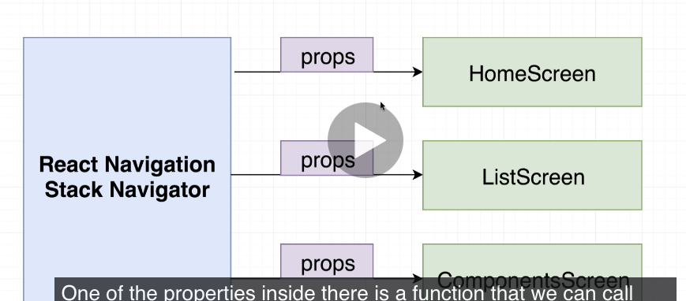

JSX is compiled by Babel into valid Javascript.

## Chapter 3
- `FlatList` is a native react component that can be used to creaete a list.
- `data` and `renderItem` are two props that are required.
- without a key property for a list, react Native will delete entire list, and rebuild whole list even if you remove only one element from list. Using key, React Native can detect it only removed one element from list using a key.
- using a key, react will only delete one element and one small part of Dom. the key ties piece of data to element on screen. so if we give list a key id, react native will create element out of it and tag with same key id. It now knows which element in screen to clean up if the data is deleted.
```text
    <FlatList
      keyExtractor={(friend) => friend.name }
      data={friends}
      renderItem={({ item }) => {
        return <Text>{ item.name } </Text>
      }}
    />
```

## Chapter 4
- console.log appears in window running react native package. they don't appear on the mobile device.
- `Button` component is simple, `TouchableOpacity` component can do a lot more customization.
- TouchableOpacity can be used to touch for any kind of element. it wraps an element and if you touch element, an on press event is fired.
- the `Button` element comes with default styling.
- when you touch the TouchableOpactiy element, it briefly fades out, that's the opacity. gives feedback to users to let them know they touched it.
- `StackNavigator` is what allows us to navigate or change content that is visible on screen to users. `stacknavigator` decides what to show. passes down props to component.


- a component shown by the stack navigator will have a props object. the `props.navigation.navigate` property can change components. can change content on screen of our device. pass in string that matches the route names which is the object that we pass as the first argument to the `createStackNavigator` function:
```text
const navigator = createStackNavigator( // used to show different screens to our user. that's navigation, appear different screens of content to our user.
  {
    Home: HomeScreen,
    Components: ComponentsScreen,
    List: ListScreen,
  },
  {
    initialRouteName: 'Home',
    defaultNavigationOptions: {
      title: "App"
    }
  }
);
```
- the 3 route names are `Home`, `Components`, `List`, the keys of the first object. It then renders appropriate component.
- remember when you return in a component, has to be one component so use a `View` cmoponent to wrap everything. Kind of like a `template` compoennt in Vue.js

- The below
	`<ImageDetail title='Forest' imageSource={require('../../assets/forest.jpg')}/>`
- numbers assigned to props have to be in curly braces, strange right?

## Chapter 5
- `state` systems tracks piece of data that chagnes over time in our application, anytime data changes, content changes in our device. similar to props (commounicating parent to child)
- for state, if you update it, the screen will rerender. The variable has to be state for it to render. React-native does not watch non-state variables and change the screen. 
- need to use `useState` hook. using this hook, react will watch the data.
- this is how to set up state:
  `const [counter, setCounter] = useState(0);`
- the above sets a default state of 0. sets `coutner` to 0. the square brakcet is array destructuring in es6.
- when doing it this way, we don't want to modify counter variable directly like `counter++`. use the `setCounter` function that is returned from `useState`. Should look something like this:

```text
  const [counter, setCounter] = useState(0);

  return <View>
    <Button title="Increase" onPress={() => {
      setCounter(counter + 1);
    }}/>
    <Button title="Decrease" onPress={() => {
      setCounter(counter - 1);
    }}/>
```
- `setCounter` is used to update state variable. react does not detect if you manually make changes to state variable. when the screen rerenders, react-native knows that the component was rendered once so the useState doesn't reinitialize counter back to 0.
- we never modify state variable directly. never on the left hand side of equal sign.
- wyen a component is re-rendered, all children get re-rendered too. 
- state can be passed as a prop too.
- each copy of component with state has own copy of state.
- remember that `renderItem` prop gets called for every item inside of the `FlatList`


## Components from React Native
- FlatList. 
    - props: horizontal, data, renderItem, showsHorizontalScrollIndicator
- TouchableOpacity - highly customizable component that can detect a press like text or an image.
- Button - shows button and detects a press.
    - props: onPress, title
- View - used to wrap everything in a return statement in a component. return one single root element.
- Image - used to display images.
    - props: source
