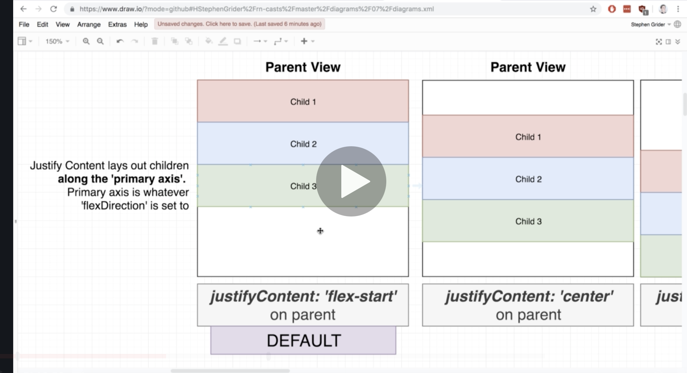

JSX is compiled by Babel into valid Javascript.

## Chapter 3
- `FlatList` is a native react component that can be used to creaete a list.
- `data` and `renderItem` are two props that are required.
- without a key property for a list, react Native will delete entire list, and rebuild whole list even if you remove only one element from list. Using key, React Native can detect it only removed one element from list using a key.
- using a key, react will only delete one element and one small part of Dom. the key ties piece of data to element on screen. so if we give list a key id, react native will create element out of it and tag with same key id. It now knows which element in screen to clean up if the data is deleted.
```text
    <FlatList
      keyExtractor={(friend) => friend.name }
      data={friends}
      renderItem={({ item }) => {
        return <Text>{ item.name } </Text>
      }}
    />
```

## Chapter 4
- console.log appears in window running react native package. they don't appear on the mobile device.
- `Button` component is simple, `TouchableOpacity` component can do a lot more customization.
- TouchableOpacity can be used to touch for any kind of element. it wraps an element and if you touch element, an on press event is fired.
- the `Button` element comes with default styling.
- when you touch the TouchableOpactiy element, it briefly fades out, that's the opacity. gives feedback to users to let them know they touched it.
- `StackNavigator` is what allows us to navigate or change content that is visible on screen to users. `stacknavigator` decides what to show. passes down props to component.


- a component shown by the stack navigator will have a props object. the `props.navigation.navigate` property can change components. can change content on screen of our device. pass in string that matches the route names which is the object that we pass as the first argument to the `createStackNavigator` function:
```text
const navigator = createStackNavigator( // used to show different screens to our user. that's navigation, appear different screens of content to our user.
  {
    Home: HomeScreen,
    Components: ComponentsScreen,
    List: ListScreen,
  },
  {
    initialRouteName: 'Home',
    defaultNavigationOptions: {
      title: "App"
    }
  }
);
```
- the 3 route names are `Home`, `Components`, `List`, the keys of the first object. It then renders appropriate component.
- remember when you return in a component, has to be one component so use a `View` cmoponent to wrap everything. Kind of like a `template` compoennt in Vue.js

- The below
	`<ImageDetail title='Forest' imageSource={require('../../assets/forest.jpg')}/>`
- numbers assigned to props have to be in curly braces, strange right?

## Chapter 5
- `state` systems tracks piece of data that chagnes over time in our application, anytime data changes, content changes in our device. similar to props (commounicating parent to child)
- for state, if you update it, the screen will rerender. The variable has to be state for it to render. React-native does not watch non-state variables and change the screen. 
- need to use `useState` hook. using this hook, react will watch the data.
- this is how to set up state:
  `const [counter, setCounter] = useState(0);`
- the above sets a default state of 0. sets `coutner` to 0. the square brakcet is array destructuring in es6.
- when doing it this way, we don't want to modify counter variable directly like `counter++`. use the `setCounter` function that is returned from `useState`. Should look something like this:

```text
  const [counter, setCounter] = useState(0);

  return <View>
    <Button title="Increase" onPress={() => {
      setCounter(counter + 1);
    }}/>
    <Button title="Decrease" onPress={() => {
      setCounter(counter - 1);
    }}/>
```
- `setCounter` is used to update state variable. react does not detect if you manually make changes to state variable. when the screen rerenders, react-native knows that the component was rendered once so the useState doesn't reinitialize counter back to 0.
- we never modify state variable directly. never on the left hand side of equal sign.
- wyen a component is re-rendered, all children get re-rendered too. 
- state can be passed as a prop too.
- each copy of component with state has own copy of state.
- remember that `renderItem` prop gets called for every item inside of the `FlatList`
- if we do string interpolation, we do have to use string interpolation inside curly braces. For example:
```text
 <Button title={`Increase ${color}`} />
```

**General rule for sharing state among components**
- Create state variables in the most parent that needs to either 1. read value 2. change value.
- Pass the state down to children. How do they change the values? How do they read it? You can pass it as a prop to child to help the child to read. If the children needs to change the value in the aprent, you can pass a callback function. The callback is called in the child which changes state in the parent.


- if we have multiple pieces of state that are closely related,  and known ways we are changing state, great candidate to manage state by a reducer. IF you have closely related state, and know how you're changing each of them, use a reducer.
- What is a **reducer**? Fancy name. Function taht has two arguments, first is a object with **all** state, argument 2 is object that describes that update that we want to make. Function that manages changes to an object, that's what a reducer is.
- first object might look like `{red:0, green:0, blue:0}` and second might look like `{colorToChange: 'red', amount: 15}`. Similar to what we have here... which makes us think we should make a reducer:

```text
  const setColor = (color, change) => {
    switch (color) {
      case 'red':
        red + change > 255 || red + change < 0
          ? null
          : setRed(red + change);
        return;
      case 'green':
        green + change > 255 || green + change < 0
          ? null
          : setGreen(green + change);
        return;
      case 'blue':
        blue + change > 255 || blue + change < 0
          ? null
          : setBlue(blue + change);
        return;
      default:
        return;
    }
  };
``` 
- arugment 2 for a reducer is similar to the above setColor function inside our component.
- inside reducer, we look at argument 2, and make some decision on how to change argument 1. 
- never change argument 1 directly in a reducer.
- reducer returns new state object.
- `hooks` add in some additional functionality to a functional component.
- this is how to initialize state using reducers. the `dispatch` is what calls the reducer function. Whenever we want to change state, we call `dispatch` with an action object. When you call dispatch, react-native calls the reducer passed to `useReducer`. dispatch, calls reducer, reducer returns state which is one of the two things returned from useReducer, and when reducer returns value react rerenders component. :

```text
  const [state, dispatch] = useReducer(reducer, {red: 0, green: 0, blue: 0})
```
and reducer function looks like this:
- to change state in reducer, do not make change to state object directly. return a new state object by copying all of state over to a new object/dictionary.:

```text
const reducer = (state, action) => { //how to change state object is what the action is, the 2nd argument
  // state is an object with red:, green:, blue:
  // action is something like how to change state. we define the properties, something like {colorToChange: 'red', amount: 15 }

  switch(action.colorToChange) {
    case 'red':
      return { ...state, red: state.red + action.amount }
    case 'green':
    case 'blue':
    default:
  }

};
```
- in the syntax above, the red overwrites the red in the `...state` portion so the red on the right takes over. Remember, in a reducer we never want to change the state argument #1 directly.
- need to return something from reducer to use as state.
- the 2nd argument, action, in the reducer usually has `type` and `payload`, those are the conventions.
- We spread in the reducer like this:

```text
 return { ...state, count: state.count + action.payload };
```
why? we take all different value sout of state and put it in new object. So why spread? We do it to future proof our reducer if we add new key/value pairs. 

__Handling Text INputs__
- weird thing with handling text inputs. zero styling by default, so nothing to indicate taht it's visible on screen.
- might want to use props to prevent capitalziation and correction. `autoCapitalize="none"` `autoCorrect={false}`
- how do we get state of input into parent? Well we never want to reach from parent to child and get state. Parent should not know of child state. so we use a callback to talk to parent from child that is passed from parent. using `onChangeText`, the callback is called every time user types in input. We cna use this callback to update state in parent, when state changes, the parent rerenders and the child rerenders too. `onChangeText` is called with new value that user types in input.
- remember everytime we update state variable, component rerenders.


## Chatper 7
Styling


3 systems:
1. we use box object from web development when we position single element by itself.
2. flexbox is also from web. used to position children within parent.
3. position positions single child inside parent. used to override box or flexbox. 
- box object model first:
    - focuses on one element
    - refers to position around piece of content. 
    
    

you can use properties to adjust width of different layers. margin, borderwidth, padding are what we can adjust.you can add to top, bottom, left and right. there are actually properties like `margin` for all sides, `marginVertical` for top and bottom, and `marginHorizontal` for left and right.
- flex box model. how siblings are algiend in commmon parent.

Some flex box properties:
- using flexbox, you can put `alignItems: 'flex-start'` to parent element. affects children in horizonttal direction. default is 'stretch' for `align-items` which means it will stretch and take up as much horizontal space as it possibly can. `flex-start` makes children move to the left as it possibly can but still keep room for the text.
- `flexDirection` is another flex box property. that determines the primary adn secondary axis. If you put row, the children are in a single row. It affects `alignItems` too. if you use `flexDirection: row`, `alignItems` will affect the children's placement in the row. the default of `alignItems` is stretch so teh children will now stretch vertically to fill up the height. `flex-end` for alignItems will now move the children to the very bottom.
- `justfiyContent` is another flex box property. affects how children are laid out vertically, opposite of `alignItems`. If we have flexDirection of column on tthe parent, justifyContent will work veritcally which is the opposite of alignItems. By default, justifyContent affects teh children vertically. the property lays out the children along the primary axis or whatever `flexDirection` is set to. That's the best way to think about `justifyContent`.


- in the abovewe can see that `flexDirection` is still column, and the `justifyContent` is set to `flex-start` which pushes up the children to the top. `alignItems` is still set to `stretch` which is why tthey take up the whole row.

So this with `row` for flexDirection:
```text
  viewStyle: {
    borderWidth: 3,
    borderColor: 'black',
	height: 200,
	flexDirection: 'row',
	justifyContent: 'space-around',
  },
```
makes the app look like this:


- they are aligned in a row, or horizontally, and there's space aroiund each item in the image above.
- remember that `alignItems` is `stretch` by default so thatt's why thtey take up the whole column in thet image above.

Here are the properties we can change:


- the `flex` property of a child changes how much space the child takes up within the parent. flex: 1 makes it so that teh child takes up as much space as it possibly can. 
- `flex` operates in the same direction as `flexDirection` which by default is column,. So `flex` will cause child to expand vertically.
- Assume `flexDirection` is defautl column. You can have flex values other than 1 and taht will proportion available space to children.


- on child, `align-self` overrides `alignItems` on the parent.


- I think this is what you'll need for your client:

```text
  viewStyle: {
    borderWidth: 3,
    borderColor: 'black',
	height: 50,
    flexDirection: 'row',
	justifyContent: 'space-around'
  },
  textOneStyle: {
    borderWidth: 3,
    borderColor: 'red',
  },
  textTwoStyle: {
    borderWidth: 3,
    borderColor: 'red',
  },
  textThreeStyle: {
    borderWidth: 3,
    borderColor: 'red',
  },
```
- it looks like a single row with three items with space around each item. `space-around` is similar to `space-between` except `space-around` has space round the sides.

Position:
- `absolute` makes a child completely ignored by its siblings when react lays out screen. so an element could be on top of other children. Its siblings will render without acknoledging the child with the `position: absolute`. It still obeys some flexbox properties on parent like `alignItems: flex-end`. but it will ignore `alignItems: stretch`.
- `top`, `bottom`, `right`, `left` add spacing to their named direction and are performed after everything else is placed on the screen. So it moves an element, but it does not move sibling elements. So if you move an element down by 10 using `top:10`, it could lay on top of the child below it. It's kind of like `position: absolute` in that sense.


Fill up screen:
- to fill up entire parent, use `position: absolute` so it ignored all other elements and  set `top`, `bottom`, `left`, `right` to 0. react-native shortcut for these 5 are `...StyleSheet.absoluteFillObject` in the styles section which spreads those 5 properties into the styles section. setting top, left, right, bottom to 0 means no space between the element and the outer borders. 0 distance from element to top, right, left, bottom of parent container, that's how we get child to expand to size of parent.


## Chapter 8
- use expo cli, gives you more. react-native-cli did not give enough stuff out of box.
- generate new proejct using expo cli. 
- `npx expo-cli init <project_name>` to generate new react-native project using expo.

## chapter 9
- three objects for navigation: 
    - stack navigator - click, go to another screen, back arrow on top left.
    - bottom tab navigator: tab on bottom to show different screens
    - drawer navigator- menu on left side.

- for api calls, you can use: axios, or fetch. 
  - fetch isa built in function for network requests, error handling is odd, requires more wrapper code
  - so use axios instead. separate library needs installation, easy to use, increases app size.

- you cannot just make the api call on teh top level of function to set state. If you do, it rerenders the component, calls the search api again, and the loop happens. infinite loop if you do it this way. You can'st just call teh funciton directly in the component like this. REmember updated state causd by the setter causes the component to rerender. 

## Chapter 10
- `useEffect` is a hook that allows us to call a function one time on render. only when component is first rendered. `useEffect` is a hook. YOu nee to pass a second argument which tells `useEffect` how many times to run the first argument, the function. To only run the first argument, the funciton, one time, pass an empty array as the second argument.

```text
useEffect(() => {
  <api call>;
  },[])
```
the aboe makes the api call jsut one time if you put it top level in the component. 
- we should extract hooks into seaprate files as their own separate business logic.

- when showing images using `Image` component, it's invisible even when provided the uri because it collapses itself without a fixed height and width.

- adding marginLeft to the parent with a child taht scrolls horizontally will cut off the child when it scrolls. If you apply margin left to the child instead, the child can scroll horizontally all the way to the left edge of the screen which is better. This is seen in the react-food app for the images. When you put marginLeft on teh images, they start off shifted to the right, but if you scroll, they will move to the left edge of the screen.
- how to hide scroll bars: to teh FlatList add `showsHorizontalScrollIndicator: false` to the `FlatList` component.
- add `ScrollView` to make some element vertically scrollable. You mgiht want to do this with the main display of results.
- with parent `View` elements, sometimes they expand past hte bottom border with Android,  so you need to constrain the View element.You can use flex : 1. this will tell parent to expand to only visible screen real estate and not past the bottom border.If you feel like you have cut off content or is expanding past screen, use `flex:1`. Why does View expand? React-native just puts as much content in the View as it can, so it expands. If you try to add vertical scrolling with a `ScrollView` it doesn't work on android because there's nothing to scroll. OR you can do this: Instead of using a View to wrap some number of elements because you can only return one element by default, just use `<>` and `</>` as the opening and closing tags. This by default does not allow content to go past the screen like a `View` does.
- remember that react navigation passes props to the rendered component.it has a navigation prop, and a navigate prop insdie of that. you can pass the key to taht navigate function.Stack navigator passes props to different screens and within it is a navigate function that can change screens that you register with `createStackNavigator`. you can pass the navigate prop to chilren if you need.
 
in the above, we pass through the stackNavigator as a prop, which is weird because the intermeiate component doesn't use navigate at all. So it feels weird. What else can you do? You can actually just inject navigation into a component. To do so, we can use `withNavigation` from `react-navigation` which will allow us to desetructure `navigation` from props in this component.


## Chapter 12
- How will we manage state? We will use a provider:


- any child cna access the state in provider. This is a good alternative to having all blog posts be in the index and have the index pass them down to other components. No need to pass props anymore. This is global state management like Redux. The provider can send props to any child and callbacks too.
- context is sort of like props. It's used by the Provider to pass state. Easy to communicate data from parent to super nested child whereas props we have to pass the data down one by one.
 
- context can move data from parent to deeply nested child.

```text
  return <BlogContext.Provider value={5}>
    {children}
  </BlogContext.Provider>
```
this is how you pass props to chilren using Provider.
- in short, this is how to set data in the App.js file:

```text
  return <BlogContext.Provider value={5}>
    {children}
  </BlogContext.Provider>
```
this is how to get the value in teh child:

```text
import React, { useContext } from 'react';
import BlogContext from "../context/BlogContext";

const IndexScreen = () => {
  const value = useContext(BlogContext);
  ...
```
- remember you cannot render objects in react so if you pass an array of objects or object into value, you get an error.
- remember you do not manage state with Context, you move state aroun with Context. You still manage state with something like `useState`
- so you create a Context, set the value on the context provider, export teh context. That's all we do in the provider. then in the child we just import the context, call `useContext` and we get the value.
- What's the difference between using `useReducer` and `useState` you can differentiate between cases using Reducer that are subtly different instead of writing multiple `useState`. You can do more complicated things using Reducer. can modify state in additional ways using reducer.
- below is a generic way to create many different contexts, all we need to do is pass in an action that returns a function and uses dispatch and a reducer and initialState.
```text
import React, { useReducer } from 'react';

export default (reducer, actions, initialState) => { // we can use this function and now just pass in these 3 variables.
  const Context = React.createContext();

  const Provider = ({ children }) => {
    const [state, dispatch] = useReducer(reducer, initialState);

    const boundActions = {};

    for (let key in actions) { // we iterate because all teh actions from a context do want to get bound to the same dispatch so the actions get processed by the same reducer.
      boundActions[key] = actions[key](dispatch); // this loops through all actions that came from the file, and passes dispatch into it, and sets the return function on the boundActions object.
    }

    return <Context.Provider value={{ state: state, ...boundActions}}>
      {children}
    </Context.Provider>

  };

  return { Context, Provider } // this is a reusable Context and Provider.
}
```
the action can look likeethis:

```text
const addBlogPost = (dispatch) => {
  return () => {
    dispatch({ type: 'add_blogpost' }) // dispatch isn't available in this file instead it's in createDataContext so we need to pass it in and then have that return a function closure.
  }
}; //function to dispatch an action that modifies our state. the dispatch will be the dispatch that is created by useReducer inside createDataContext
```

- how do make a show screeen. first navigate to it passing the id:
```text
        renderItem={({ item }) => { // item is a blog post object with title and id
          return (
            <TouchableOpacity onPress={() => navigation.navigate('Show', {id: item.id})}>
              <View style={styles.row}>
                <Text style={styles.title}>{item.title} - {item.id}</Text>
                <TouchableOpacity onPress={() => deleteBlogPost(item.id)}>
                  <Feather style={styles.icon} name="trash" />
                </TouchableOpacity>
              </View>
            </TouchableOpacity>
          )
        }}
```
in the above, the navigate takes a 2nd argument that is an object with the id of the element we want to show.
- below is how to get the id that is passed to the component from `navigate`
```text
  const blogPost = state.find((blogPost) => blogPost.id === navigation.getParam('id'));
```
- using the above ,we can use the state obtained fomr useContext to find the appropriate element:
```text
import { Context } from "../context/BlogContext"

const ShowScreen = ({ navigation }) => {
  const { state } = useContext(Context);

  const blogPost = state.find((blogPost) => blogPost.id === navigation.getParam('id'));
```
- where do we navigate back to pages? Well, this has a problem:
```text
      <Button
        title="Add Blog Post"
        onPress={() => {
          addBlogPost(title, content);
          navigation.navigate("Index"); // putting the navigate here isn't good because sometimes the addBlogPost might make an async call that may not resolve by the time navigate is called.
        }}
      />
```
in the above we may not want to navigate back immediately after calling addBlogPost because it may make an async call. We don't want to instantly navigate back. it's too soon. we should instead pass a callback to addBlogPost.

- to set initialValues in a component:
```text
BlogPostForm.defaultProps = {
  initialValues: {
    title: '',
    content: '',
  }
};
```

- the navigation object has another function called `pop` which goes back to teh previous screen. pops off current view from teh stack in a sense.

## Chapter 13
- JSON server is good for front-end developers who need a quick back-end for prototyping and mocking.

## Components from React Native
- FlatList. 
    - props: horizontal, data, renderItem, showsHorizontalScrollIndicator
- TouchableOpacity - highly customizable component that can detect a press like text or an image.
  - onPress (you can use this to navigate to another page and have the icon be opaque for a second to give user feedback).
- Button - shows button and detects a press.
    - props: onPress, title
- View - used to wrap everything in a return statement in a component. return one single root element.
- Image - used to display images.
    - props: source
- TextInput - for input of text
    - props: autocorrect, autoCApitalize, value, onChangeText
- Image - for displaying images
    - props: uri
    - you need to give it height and width otherwise it collapses itself.
